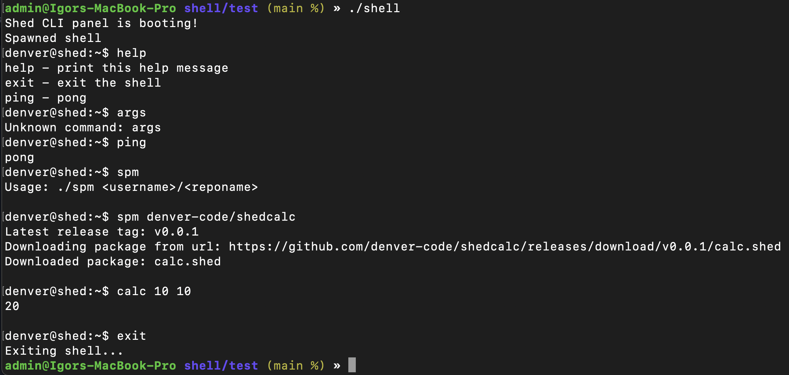

# ShedShell Panel
In a few words - this in an 'shell' emulator, that can be used as a control pannel for all *.shed projects and services.  
Basically, when you have to setup all the environment for Shed projects, you have to install a lot of tools, and configure them manually, use docker-compose or even write some scripts, because sometimes process could be complicated, and require a lot of steps. So here's the solution - ShedShell Panel. 
Out-of-box you will have access to all supported and indeed required tools, and you will be able to manage them, and use them in your projects, doesn't matter if you need run service, add new, shutdown, fresh set-up ecosystem - everything is possible using this project.

## Concept
The main idea is to have a tool, that will be able to manage all the services, that are required for Shed projects, But obviously, it's should not be limited for built-in only services and functional as some developers might want to create their own services, and use them here, and without making forks and maintaining one more spare project - they able to create own scripts and install using package manager, or moving executable file directly to the bin folder.
This modular system will allow to build own commands which will be integrated with the main system. And anyway you always welcome to create fork and maintain your own version of ShedShell Panel.

## Run
```bash
cargo run
```

## Build Release
```bash
cargo build --release
```

## Demo

Only `help`, `exit`, `ping` commands implemented directly to the code, the `args` and `dev` app were installed(manually) in a `bin` folder without any references in the code.